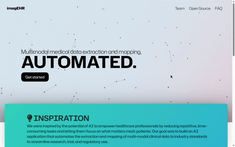

# imagEHR
This is an AI application that automates the extraction and mapping of multi-modal clinical data to industry standards to streamline research, trial, and regulatory use. By the power of AI we empower healthcare professionals by reducing repetitive, time-consuming tasks and letting them focus on what matters most "Patients". The problem is the manual mapping of unstructured clinical data wastes valuable time and delays patient care and drug development. Our solution lies in the Semi-automation of this process which can reduce delays, boost accuracy, and free clinical teams to focus on saving lives.


       



**Test it out live at https://imagehr-k7kg.onrender.com/ (note: some inference features are unavailable due to free hosting limits)**


## Table of Contents:

- [How to Use imagEHR](#how-to-use-imagEHR)
- [Application Inner Workings](#application-inner-workings)
- [Tech stack](#how-to-use-imagEHR)
- [Challenges we ran into](#challenges-we-ran-into)
- [Our accomplishments](#)
- [Lessons learned](#)
- [Next steps](#)
- [References](#)


# How to Use imagEHR
*Install PyTorch*
https://pytorch.org/get-started/locally/

**SETUP:**
```
pip install -r requirements.txt
```

**PULL SUBMODULES:**
```
git submodule update --init --remote --recursive
```

**ENVIRONMENT: *Copy `.env.example` into `.env` and fill in your API keys, etc.***

**Run the Flask Server:**
```
python main.py
```
## Code references
- https://docs.cohere.com/reference/chat
- https://www.kaggle.com/code/awsaf49/vinbigdata-cxr-ad-yolov5-14-class-train
- https://www.kaggle.com/code/awsaf49/vinbigdata-cxr-ad-yolov5-14-class-infer
- https://github.com/ultralytics/yolov5


# Application Inner Workings
Automates data extraction of EHR (text) and X-ray (image) data, and then infers how it can be mapped to industry standards for downstream research, trial, and regulatory use.

Note: There are several types of clinical data that can be used to build a patient profile (eg. pharmacokinetic, laboratory, etc.) For simplicity, this application was developed using only EHR (text) and X-ray (image) data as raw inputs for a patient’s profile.

• Cohere to extract meaningful insights from EHR
• Pre-trained model to extract meaningful data from X-ray images
• Cohere to predict what SDTM domains the data can be mapped to
• Cohere to evaluate how raw, extracted data from EHR + X-ray images map to CDISC industry standards under each SDTM domain
• Output .csv file of mapped data extractions in industry-ready format

Note: Physicians and clinical programmers can also manually add or remove any domain or variable using their judgement.

## Tech stack
• Front-end: HTML, JavaScript, css
• Back-end: Flask

## Challenges we ran into
The SDTM domains and CDISC terminology (controlled vs. non-controlled terminology) was extremely complex and hard to navigate. We had to teach ourselves how this mapping process worked. Access to real-world clinical data was limited. For example, the EHR sandbox data we used was low quality and there were not many good alternatives.

## Our accomplishments
• Low latency (< 5 minutes) throughout the automation process.
• Incorporating multi-modal data analyses to improve workflows.

## Lessons learned
• How to work together as a team with our different backgrounds in biological science and computer sciences.
• Walks help to refresh the mind, body, and spirit after working for consecutive hours.

## Next steps
• Incorporation of additional data modalities (eg. pharmacokinetic, oncology, genetics, laboratory, etc.)
• Using a more accurate vision or multi-modal model & incorporating physician feedback
• Integration with FHIR-based hospital systems to enable real-time data ingestion and seamless interoperability with EHR platforms


## References
- CDISC. Clinical Data Interchange Standards Consortium. https://www.cdisc.org/. Accessed 23 Mar. 2025.

- “Physicians Spend About 16 Minutes on EHRs Per Patient.” ASH Clinical News, n.d., https://ashpublications.org/ashclinicalnews/news/4924/Physicians-Spend-About-16-Minutes-on-EHRs-Per. Accessed 23 Mar. 2025.

- “Chest X-Ray.” Cleveland Clinic, https://my.clevelandclinic.org/health/diagnostics/10228-chest-x-ray. Accessed 23 Mar. 2025.

- “SDTM Automation.” PointCross Life Sciences, https://pointcrosslifesciences.com/sdtm-automation/. Accessed 23 Mar. 2025.
